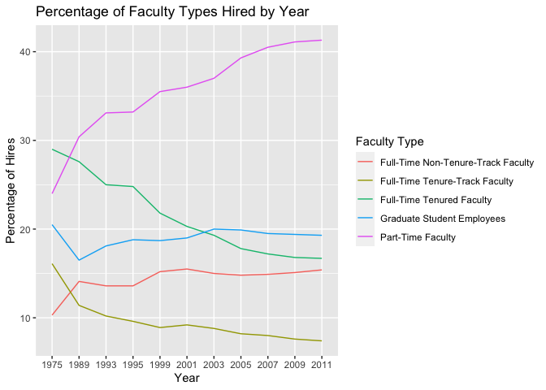
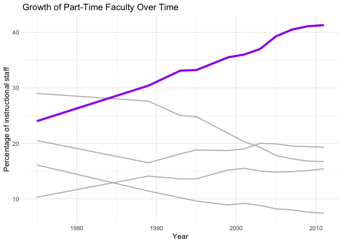
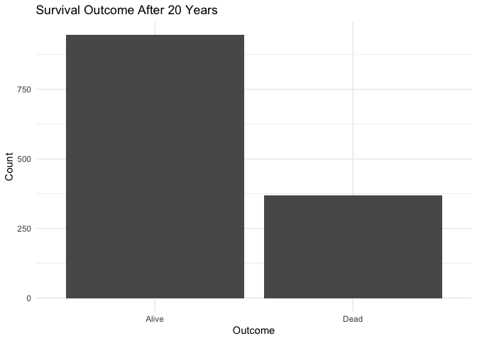
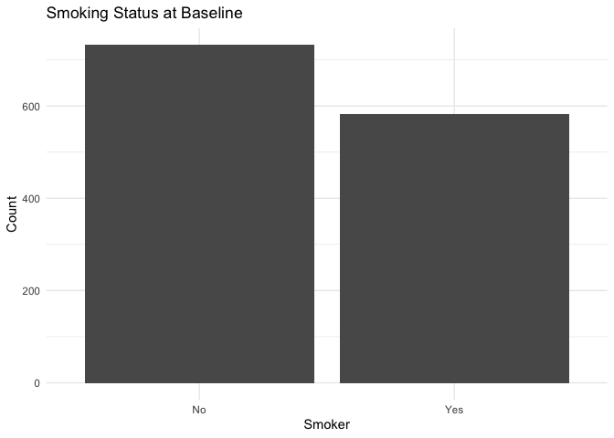
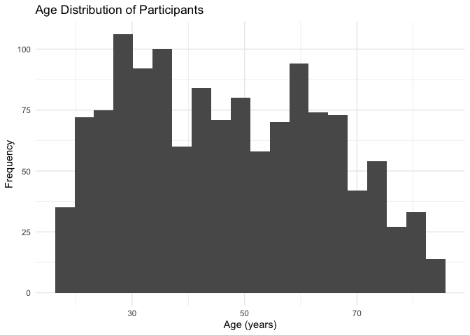
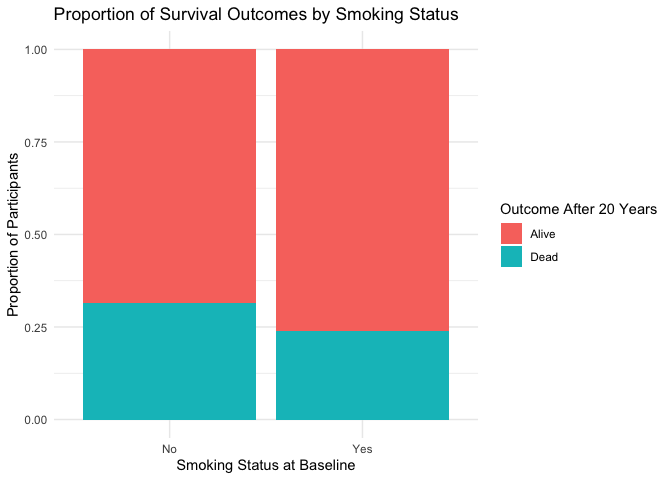
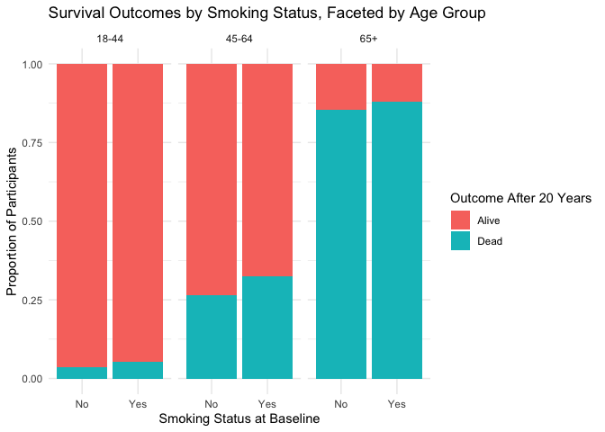

Lab 06 - Ugly charts and Simpson’s paradox
================
Cynthia Deng
02/19/2026

### Load packages and data

``` r
library(tidyverse) 
library(dsbox)
library(mosaicData) 
```

``` r
staff <- read_csv("data/instructional-staff.csv")
```

    ## Rows: 5 Columns: 12
    ## ── Column specification ────────────────────────────────────────────────────────
    ## Delimiter: ","
    ## chr  (1): faculty_type
    ## dbl (11): 1975, 1989, 1993, 1995, 1999, 2001, 2003, 2005, 2007, 2009, 2011
    ## 
    ## ℹ Use `spec()` to retrieve the full column specification for this data.
    ## ℹ Specify the column types or set `show_col_types = FALSE` to quiet this message.

### Exercise 1

``` r
staff_long <- staff %>%
  pivot_longer(cols = -faculty_type, names_to = "year") %>%
  mutate(value = as.numeric(value))
```

``` r
staff_long %>%
  ggplot(aes(x = year, y = value, color = faculty_type)) +
  geom_line()
```

    ## `geom_line()`: Each group consists of only one observation.
    ## ℹ Do you need to adjust the group aesthetic?

<!-- -->

``` r
staff_long %>%
  ggplot(aes(
    x = year,
    y = value,
    group = faculty_type,
    color = faculty_type
  )) +
  geom_line() +
  labs(title = "Percentage of Faculty Types Hired by Year",
       x= "Year",
       y= "Percentage of Hires",
       color = "Faculty Type")
```

<!-- -->

### Exercise 2

To better communicate that part-time faculty have increased over time,
the plot can visually emphasize the part-time faculty line while
de-emphasizing the others. For example, making the part-time line
thicker and using a bold color, and fading the remaining faculty types
into light gray.

``` r
staff_long %>%
  ggplot(aes(
    x = as.integer(year),
    y = value,
    group = faculty_type
  )) +

  geom_line(
    data = subset(staff_long, faculty_type != "Part-Time Faculty"),
    color = "gray",
    linewidth = 0.8
  ) +

  geom_line(
    data = subset(staff_long, faculty_type == "Part-Time Faculty"),
    color = "purple",
    linewidth = 1.5
  ) +
  labs(
    title = "Growth of Part-Time Faculty Over Time",
    x = "Year",
    y = "Percentage of instructional staff"
  ) +
  theme_minimal()
```

<!-- -->

### Exercise 3

``` r
fisheries <- read_csv("data/fisheries.csv")
```

    ## Rows: 216 Columns: 4
    ## ── Column specification ────────────────────────────────────────────────────────
    ## Delimiter: ","
    ## chr (1): country
    ## dbl (3): capture, aquaculture, total
    ## 
    ## ℹ Use `spec()` to retrieve the full column specification for this data.
    ## ℹ Specify the column types or set `show_col_types = FALSE` to quiet this message.

The original visualization does not communicate a clear story because
plotting every country at once makes the visualization cluttered and
difficult to interpret. Instead of trying to include hundreds of
categories, it makes more sense to focus on the top-producing countries
so the main patterns are visible. Additionally, a line plot would not be
appropriate because the data do not represent change over time, but
rather a single-year comparison across countries. A stacked bar chart is
a better option because it clearly shows each country’s total production
while also highlighting how much comes from capture versus aquaculture.

``` r
fish_long <- fisheries %>%
  pivot_longer(
    cols = c(capture, aquaculture),
    names_to = "type",
    values_to = "tons"
  )

# Find top 15 countries by total production
top_countries <- fish_long %>%
  group_by(country) %>%
  summarise(total = sum(tons)) %>%
  slice_max(total, n = 15)

fish_top <- fish_long %>%
  filter(country %in% top_countries$country)

# Stacked bar chart
ggplot(fish_top,
       aes(x = reorder(country, tons, sum),
           y = tons,
           fill = type)) +
  geom_col() +
  coord_flip() +
  labs(
    title = "Fishery Production by Country (2016)",
    subtitle = "Top 15 producers, split by Capture vs Aquaculture",
    x = "Country",
    y = "Production (tons)",
    fill = "Production type"
  ) +
  theme_minimal()
```

<!-- --> \### Stretch
Practice

``` r
data("Whickham")
```

``` r
data("Whickham")
?Whickham
library(performance)
```

    ## Warning: package 'performance' was built under R version 4.3.3

1.  These data come from an observational study, not an experiment. The
    researchers did not assign people to be smokers or non-smokers.
    Instead, they simply recorded each woman’s existing smoking status
    at the baseline survey (1972–1974) and then followed up 20 years
    later to see whether she was alive or dead.

2.The dataset contains 1314 observations. Each observation represents
one woman who participated in the Whickham survey.

3.  There are 3 variables: outcome, smoker, and age

``` r
ggplot(Whickham, aes(x = outcome)) +
  geom_bar() +
  labs(
    title = "Survival Outcome After 20 Years",
    x = "Outcome",
    y = "Count"
  ) +
  theme_minimal()
```

<!-- -->

``` r
ggplot(Whickham, aes(x = smoker)) +
  geom_bar() +
  labs(
    title = "Smoking Status at Baseline",
    x = "Smoker",
    y = "Count"
  ) +
  theme_minimal()
```

<!-- -->

``` r
ggplot(Whickham, aes(x = age)) +
  geom_histogram(bins = 20) +
  labs(
    title = "Age Distribution of Participants",
    x = "Age (years)",
    y = "Frequency"
  ) +
  theme_minimal()
```

<!-- -->

4.  Smoking status should be associated with higher mortality rates. In
    other words, women who were smokers at baseline would be more likely
    to have the outcome Dead, while women who were non-smokers would be
    more likely to have the outcome Alive.

5.  

``` r
Whickham %>%
  count(smoker, outcome) %>%
  group_by(smoker) %>%
  mutate(proportion = n / sum(n))
```

    ## # A tibble: 4 × 4
    ## # Groups:   smoker [2]
    ##   smoker outcome     n proportion
    ##   <fct>  <fct>   <int>      <dbl>
    ## 1 No     Alive     502      0.686
    ## 2 No     Dead      230      0.314
    ## 3 Yes    Alive     443      0.761
    ## 4 Yes    Dead      139      0.239

``` r
ggplot(Whickham, aes(x = smoker, fill = outcome)) +
  geom_bar(position = "fill") +
  labs(
    title = "Proportion of Survival Outcomes by Smoking Status",
    x = "Smoking Status at Baseline",
    y = "Proportion of Participants",
    fill = "Outcome After 20 Years"
  ) +
  theme_minimal()
```

<!-- --> This stacked
bar chart shows the conditional proportions of survival outcomes (Alive
vs Dead) within each smoking group. Overall, most women in both groups
were still alive after 20 years. Surprisingly, the proportion of women
who died is slightly higher among non-smokers than smokers.
Specifically, about 32% of non-smokers are in the “Dead” category
compared to about 24% of smokers.

6.  

``` r
Whickham <- Whickham %>%
  mutate(
    age_cat = case_when(
      age <= 44 ~ "18-44",
      age > 44 & age <= 64 ~ "45-64",
      age > 64 ~ "65+"
    )
  )
```

7.  

``` r
Whickham %>%
  count(smoker, age_cat, outcome)
```

    ##    smoker age_cat outcome   n
    ## 1      No   18-44   Alive 327
    ## 2      No   18-44    Dead  12
    ## 3      No   45-64   Alive 147
    ## 4      No   45-64    Dead  53
    ## 5      No     65+   Alive  28
    ## 6      No     65+    Dead 165
    ## 7     Yes   18-44   Alive 270
    ## 8     Yes   18-44    Dead  15
    ## 9     Yes   45-64   Alive 167
    ## 10    Yes   45-64    Dead  80
    ## 11    Yes     65+   Alive   6
    ## 12    Yes     65+    Dead  44

``` r
ggplot(Whickham, aes(x = smoker, fill = outcome)) +
  geom_bar(position = "fill") +
  facet_wrap(~ age_cat) +
  labs(
    title = "Survival Outcomes by Smoking Status, Faceted by Age Group",
    x = "Smoking Status at Baseline",
    y = "Proportion of Participants",
    fill = "Outcome After 20 Years"
  ) +
  theme_minimal()
```

<!-- -->

When we facet the survival outcome plot by age category, the
relationship between smoking and mortality changes substantially. In the
youngest group (18–44), nearly all participants survive regardless of
smoking status, although smokers show a slightly higher proportion of
deaths. In the middle age group (45–64), the difference becomes more
noticeable: smokers have a higher conditional probability of being dead
after 20 years compared to non-smokers. In the oldest group (65+),
mortality is very high for both smokers and non-smokers, but smokers
again show a slightly greater proportion of deaths.When we compare
smokers and non-smokers within the same age groups, the expected pattern
emerges: smoking is generally linked to worse survival outcomes.
